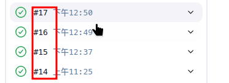

# Jenkins CI

## Jenkins Variables

Jenkins 提供了许多内置变量，可以用来生成唯一的镜像标签。常用的变量包括：

* BUILD_ID：当前构建的唯一 ID。

* BUILD_NUMBER：当前构建的编号（每次构建递增）。

    

* GIT_COMMIT：当前 Git 提交的 SHA-1 哈希值（前 7 位即可）。

* BRANCH_NAME：当前 Git 分支的名称。

## Classic Jenkinsfile Example

```groovy
{{#include ../mdbook-files/Jenkinsfile}}
```