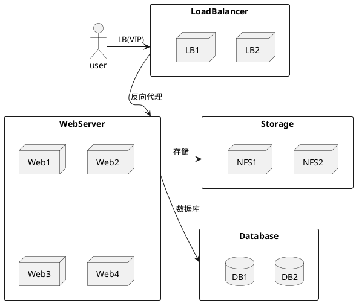

# Some Funny Docker Projects

I collected some funny docker projects here. If you want to try, confirm you install docker and docker-compose first.

```plantuml
@startuml
user as u

rectangle Storage as st{
  node NFS2
  node NFS1
}

rectangle Database as db{
  database DB2
  database DB1
}

rectangle WebServer as server{
  node Web1
  node Web2
  node Web3
  node Web4
}

rectangle LoadBalancer as lb{
    node LB2
    node LB1
}

u -> lb: LB(VIP)
lb -> server: 反向代理
lb -[hidden]-> server
st -[hidden]-> db: 存储
server -> db: 数据库
server -> st: 存储
@enduml
```